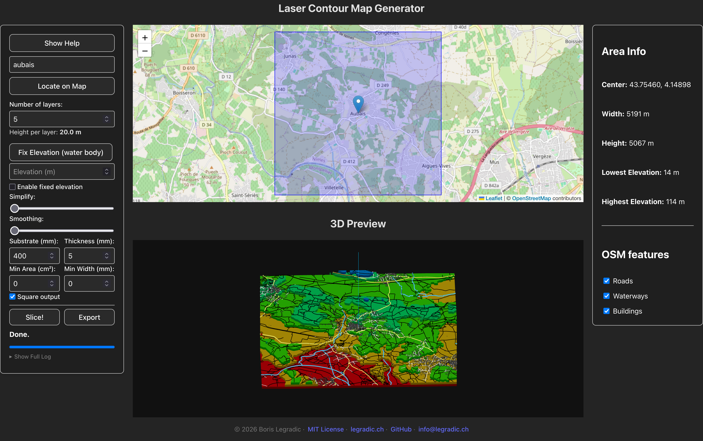

# Laser Slicer – Laser‑Cuttable Contour Map Generator

Turn any point on Earth into a **stack of precisely‑aligned SVG layers ready for laser cutting**.  
Laser Slicer downloads SRTM elevation data, slices it at the interval you choose, and gives you:

Live site: [laserslicer.legradic.ch](https://laserslicer.legradic.ch)


* A **ZIP archive** of SVG files (one per contour layer)  
* A **browser 3‑D preview** of the stacked model  
* A **Dockerised, reproducible workflow** that runs the heavy lifting in Celery workers


---

## Features

| Front‑end (Vite + React)                | Back‑end (Django 5 + Celery)          |
|-----------------------------------------|---------------------------------------|
| **Leaflet map** – pick any address or drop a pin | **Geocoding** through Nominatim |
| Parameter panel – slice height, base height, simplification | Fetch & clip **SRTM 30 m** DEM |
| **Slice** button launches background job | Contour generation with GDAL / Matplotlib |
| Live **Three.js** 3‑D preview of layers | Optional simplification with Shapely |
| **Download SVGs** – packaged as a ZIP | SVG export via `svgwrite` |
| Hot‑reload dev server (`npm run dev`) | **Celery + Redis** task queue |
| Caddy reverse proxy (HTTPS out‑of‑the‑box) | Single‑command **Docker** deploy |

---

## Quick Start (Docker)

```bash
# 1. Clone the repo
git clone https://github.com/<your‑user>/laser_slicer.git
cd laser_slicer

# 2. Copy environment template and adjust if needed
cp env.example .env   # edit DB credentials, secret key …

# 3. Fire everything up
docker compose up --build
```

Visit **http://localhost:5173** in your browser.
The front‑end talks to the Django API at **http://localhost:8000**.
The API enforces CSRF protection. Ensure your `.env` defines matching
`DJANGO_CORS_ALLOWED_ORIGINS` and `DJANGO_CSRF_TRUSTED_ORIGINS`
so the browser can send the `csrftoken` cookie with each request.

### Production

```bash
docker compose -f docker-compose.prod.yml --env-file .env.docker up -d --build
```

Caddy terminates TLS on ports 80/443 and proxies `/api` to Django ``backend:8000``.

---

## Local Development (without Docker)

| Requirement | Version |
|-------------|---------|
| Python      | 3.10 +  |
| Node        | 18 +    |
| Postgres    | 16      |
| Redis       | 7       |
| GDAL        | 3.6 +   |

```bash
# Back‑end
python -m venv .venv && source .venv/bin/activate
pip install -e ".[dev]"
cp .env.example .env          # configure DB, secret key …
python manage.py migrate
python manage.py runserver 0.0.0.0:8000

# Celery worker (in another shell)
celery -A config worker -l info

#redis (yet another shell)
redis-server

# Front‑end
cd frontend
npm install
npm run dev 
```

---

## Project Layout

```
.
├── core/               # Django project
├── frontend/           # Vite + React app
├── caddy/              # Custom Caddy build
├── data/srtm_cache/    # DEM cache (mounted volume)
├── docker-compose*.yml
└── README.md
```

---

## API Endpoints

| Method | Endpoint                        | Description                       |
|--------|----------------------------------|-----------------------------------|
| `POST` | `/api/contours/`                | Start slicing task with parameters |
| `GET`  | `/api/contours/<uuid>/`         | Check status and result of a task |
| `GET`  | `/api/contours/<uuid>/download/`| Download resulting ZIP file       |
| `GET`  | `/api/elevation-range/`         | Get min/max elevation for a given bounding box |
| `GET`  | `/api/status/`                  | Basic health check/status         |


---


## Roadmap

- [ ] Introduce roads and houses as extra layer 
- [ ] Export STL for 3‑D printing  
- [ ] CI/CD (workflow dispatch to Docker Hub)

---

## Contributing

1. Fork the project & create a feature branch (`git checkout -b feature/my_feature`)
2. Commit your changes with conventional commits
3. Run `pre‑commit run --all-files` and ensure tests pass (`pytest`)
4. Open a Pull Request 😊

---

## License

Distributed under the **MIT License**.  
See [`LICENSE`](LICENSE) for more information.

---

## Author

Created by **Boris Legradic**  
Feel free to reach out via [GitHub](https://github.com/borsic77) or [email](mailto:boris@legradic.ch)

---

## Acknowledgements

* NASA / NGA – SRTM data  
* OpenStreetMap & Nominatim  
